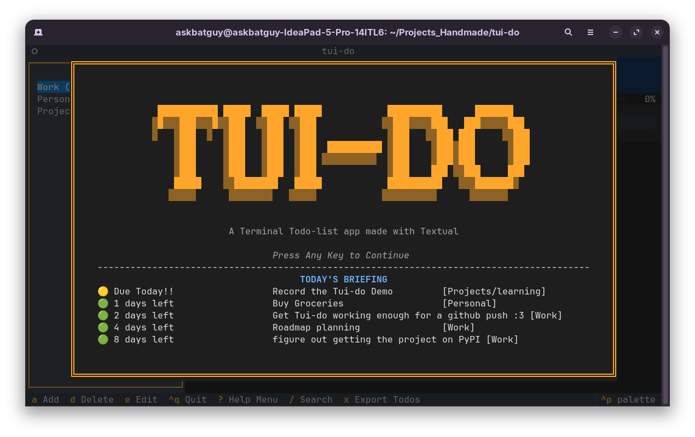

# Tui-do 

Yet another todo manager - but this one lives in your terminal.

## Features

- **Category Management** - organise todos into categories
- **Todo CRUD** - add, edit, delete, and toggle todos
- **Priority & Due Dates** - set priority levels and due dates
- **Overdue Indicators** - overdue todos highlighted in red
- **Fuzzy Search** - global search across all todos with match highlighting
- **Sort Modes** - sort by name, priority, or due date, defaults to date of creation (None)
- **Hide Completed** - toggle visibility of completed todos
- **Daily Briefing** - urgent todos surfaced on startup splash screen
- **Markdown Export** - export todos to Obsidian-compatible markdown
- **Keyboard Driven** - full keyboard navigation with contextual footer hints
- **Mouse Support** - click to view, right-click to edit, click to toggle
- **Help Menu** - look at all the keybinds, find tips to use the app
- **Themes** - works with all Textual built-in themes via `Ctrl+P`


## Installation & Running

```bash
git clone https://github.com/Askbatguy/tui-do.git
cd tui-do
python3 -m venv .venv
source .venv/bin/activate  # Windows: .venv\Scripts\activate
pip install -r requirements.txt
python -m tui_do.app
```

## Gallery



### Demo Reel
[](https://asciinema.org/a/O9ck3wxSd6DDVbxp)


## Roadmap

- [ ] Install script for Linux, Mac, and Windows with global alias
- [ ] PyPI package (`pip install tui-do`)
- [ ] Homebrew tap
- [ ] Empty state message when a category has no todos
- [ ] Interactive first-launch tutorial

## Built With

- [Textual](https://textual.textualize.io/) — TUI framework (Beautiful Documentation - the actual goat)
- [Rich](https://rich.readthedocs.io/) — terminal formatting (made by the same guy :O )
- Python 3.14 
